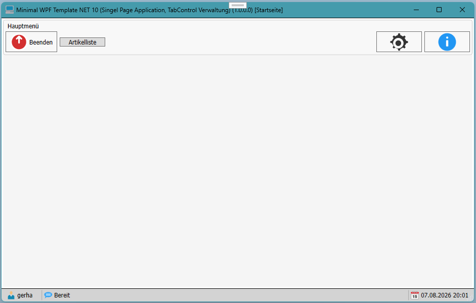
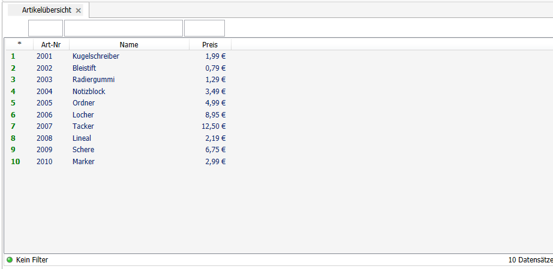
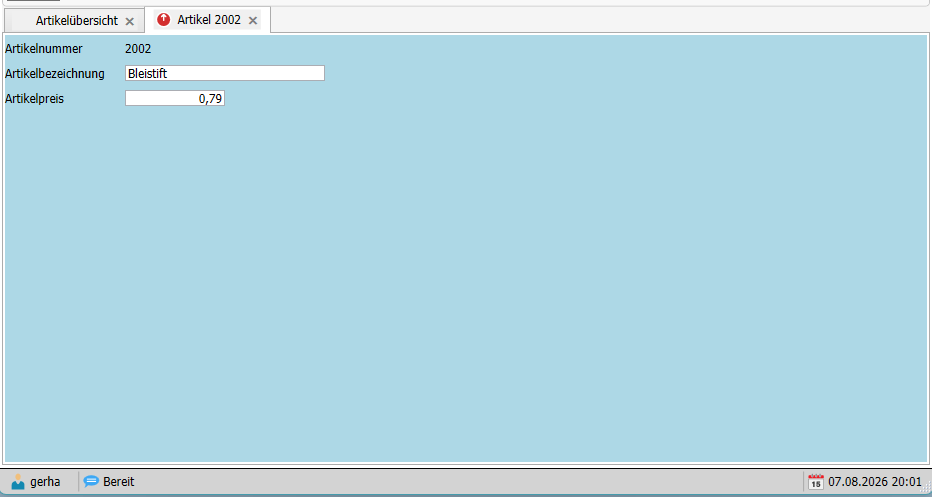

# MinimalWPF Projekt Template

In diesem Demo soll eine alternative Dialogführung gezeigt werden.

In eine Liste werden Daten geladen und in einem ListView (AdvancedListView) angezeigt, das in einem Custom TabControl (AdvancedTabControl) dargestellt wird.

Per Doppelklick wird ein weiters TabItem geöffnet, in dem die Daten des ListView als Detailansicht angezeigt werden. In diesem TabItem können die Daten bearbeitet werden.
So können weiter TabItems geöffnet werden, die jeweils die Daten des ListView als Detailansicht anzeigen.

- Erste Version
